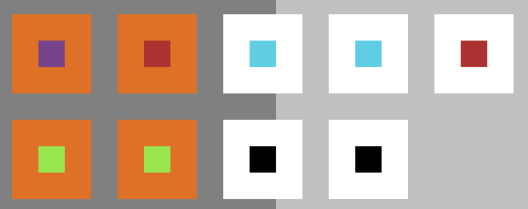

**NOTE THIS IS COPIED FROM THE ORIGINAL DOCUMENTATION AND THIS WILL NOT BE INCLUDED IN THE WORD COUNT**

Here's a diagram I drew that shows a representation of the circles and the slots. In the middle of each 3x3 section is a pin that fills a slot, this diagram is if the first pin combination was for the outer circle, you can see there are 5 slots at the top and four at the bottom, so the top row is the outer circle.
 * The purple dot is the third pin combination being just one pin.
 * The red dots are the second pin combination, always being on the outside.
 * The blue dots are the first pin combination being on the outside per random chance.
 * The black dots are the fourth pin combination being on the inner circle at the end.
 * The green dots are the fifth pin combination being on the inner circle at the start.
 * The orange slots show that those slots are the two that are shared between the circles.
