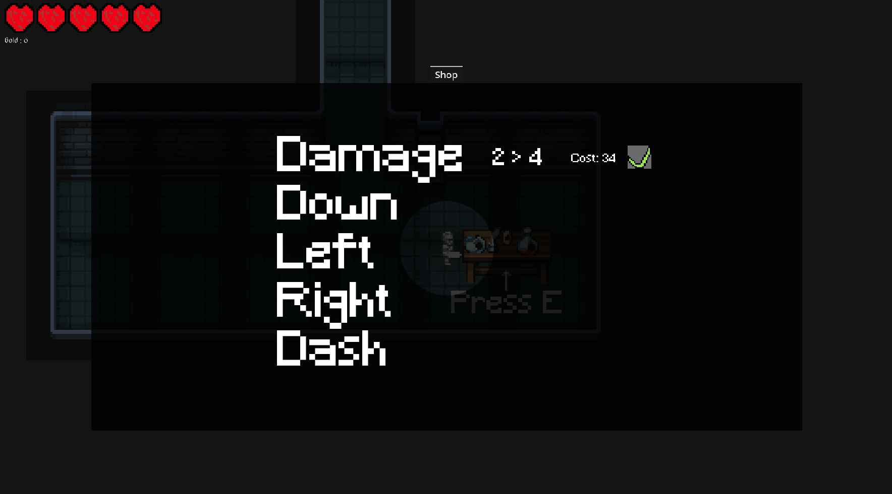
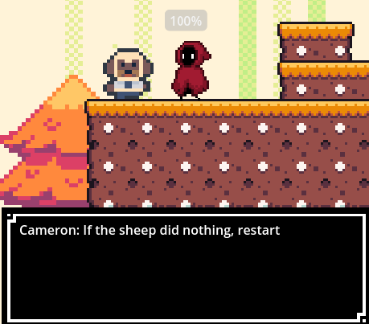

# Planning
  * Explain the design process:
  * Constraints and implications for decision-making:
  * Explains technology theories, concepts and principles and describes the properties of materials or data or systems to address a need, problem, or challenge:
  * Thinks critically, drawing on data and information to solve problems:
    
  * The unit was designed to allow students to fail so that they can learn and improve their problem-solving
    
  * The unit is designed to be more general so that skills can transfer
    
  * Make the document interesting and fancy (For better grades)
    
  * _**Write about the ethics (Why open source)**_
   
  * _**Write about the current state of game dev and why the layoffs**_
    
  * Write about the understanding gained and how it was/can be applied to future learning/assignments
    
  * _**If you could redo past assignments with new knowledge**_

# Table of Contents
   * [Assignment 2 (Minigame)](#Assignment-2)
   * [Assignment 3 (Save States)](#Assignment-3)
   * [Assignment 4 (Dialogue)](#Assignment-4)
   * [Ethics and Sustainability](#Ethics-and-Sustainability)
   * [Short Conclusion](#Short-Conclusion)
     

# [Assignment 2](https://docs.google.com/document/d/1NOPSS31VhK3m1wPlNjfQJaF2LzBFg1Mv6ji6-1DQa3Y/edit?usp=sharing) (Minigame)
   * This task was to make a minigame, it was designed to allow students to grasp subparts of game development as a whole, including things like programming, design, planning, documentation and more, this is to let students have more of an insight into game development to allow them to specialise into the subpart of their choice later on. The main skill I learnt from this assignment was planning as it was the skill I most needed to work on.
   
   *  I started by figuring out the main idea for my minigame and ended up choosing the lockpicking minigame from [Starfield](https://bethesda.net/en/game/starfield). After getting the idea I got straight to work on the project adding in all the main gameplay, then I wrote about the gameplay in my documentation and did some testing with family members to ensure the final product was what the players wanted, and did the necessary tweaks to the game adding in all the feedback.

   * Due to this minigame being a bit more complex and having randomisation factors involved I had to plan out how the pins would spawn and where the missing pins would be etc...  [This](Pins-Docu.md) is how I planned the pins spawn conditions, I decided to plan this way because I wanted to learn how to use [Aseprite](https://www.aseprite.org/) at the time, this allowed me to learn [Aseprite](https://www.aseprite.org/) and use it for future projects.
     
   * Planning skills are always important no matter the subject, before every task I create a written plan in my notes, it's just simple scrappy notes but it helps me stress less about my workload, here's a really dumbed-down example of what this looks like:

     | Assignment | Issue | Solution and Time |
     | :---: |  :----: | :----: |
     | Game-Dev | Documentation | 1500 words therefore write 250 words a day **Approx 1 hour** |
     | Game-Dev | Item 1 | Finish by Friday **Approx 30 minutes a day** |
     | Game-Dev | Item 2 | Finish by Monday **Approx 15 minutes a day** |
     | Game-Dev | Item 3 | Finish by Wednesday **Approx 20 minutes a day** |
     | Game-Dev | In general | Plan each item out and assign a goal to reach by the end of each day |

   * Whenever I plan something I usually plan the main features and leave out the gameplay, this has resulted in not a single game I've made being fun, so from now onwards I will plan the gameplay first but also plan the entirety of the project right at the start, with deadlines and allowing for extra time for safety. In turn, this will improve my workflow and allow me to get straight onto the task instead of planning along the way and working gameplay into it.

   * If I could redo this assignment I would plan out the entire assignment right at the beginning before I even touched any game development tools, this would have saved me countless hours of issues that revolved around planning the pins and coding the circles and even more. Planning was something I lacked whilst making this assignment but it is also something that this assignment taught me.
     
   * [Table of Contents](#Table-of-Contents)

# [Assignment 3](https://docs.google.com/document/d/1oKG_SgVptfr3FlIjtfTagEakSAonJlZFscl0Sa1Ja-Q/edit?usp=sharing) (Save States)
   * This assignment was designed to teach students how to make save states, however, this assignment didn't only teach me how to make save states but also almost every part of a game, I had to create the UI, Art, Sound, Gameplay and more, and this taught me a lot about making games and improved my workflow for future work. But I had an issue, I wasted too much time making the main feature (Saving) and by the time I had made a [Saving System](save_controller.gd) I had nothing to save with it which defeated the whole purpose of making it.
     
   * Unfortunately I didn't learn from my main mistake with this assignment. When making [Assignment 4](#Assignment-4) I started with the [Dialogue System](Dialogue.gd) which was the main feature, however, this system took me so long that I had very little time to make the gameplay fun, interactive and intuitive. This issue is my biggest flaw as of current and has affected all of my work, whether its personal or school work.
     
   * **Explain the design Process** Learning from [Assignment 2 (Minigame)](#Assignment-2), my design process started with planning, however as previously mentioned I did not fully plan from start to finish which became a big issue. After needing improvement planning I got to work on the project, coding the saving system and AI for enemies, etc.. In class I had multiple students test my project and give feedback, as a developer it hurt to hear what I thought was good be criticized but it was necessary to take the game to the next level, I then applied that feedback and finalized the project with a few small iterations.
     
   *  The main constraint that I had whilst making this project was 'Time', I did not realise that my project was too ambitious until it was too late. This image shows the shop that I tried to implement into the game but quickly ran out of time and had to completely scrap. **Come back to this**
     
   * Saving is a key part of a lot of games, it allows the player to not risk losing all their progress at once and lets the player explore varying options throughout the game risk-free, this encourages player choice and increases player enjoyment. Now that I have made a saving system I understand the fundamentals and can apply this knowledge to future projects to allow them to save as well.
     
   * Just like how I would redo [Assignment 2 (Minigame)](#Assignment-2), I would also cater more time into the documentation of this assignment, A key issue I found with all my documentation up until this point is not asking 'Why', Reading [this](snippet.md) it is very clear that I am just writing exactly what I did, here is a rough example of how I would have rewritten [that](new-snippet.md), this is much more telling, it gives more information to the reader and doesn't explain each line of the code directly. After I write all my documentation I re-read it and ask myself "Why?" if I haven't explained something I'll write the 'Why'.
     
   * [Table of Contents](#Table-of-Contents)
   

# [Assignment 4](https://github.com/Ch3ster8/DT2_Assignment_1) (Dialogue)
   * **What the assignment was and what I learnt from it** This assignment was designed to teach students how to make branching decisions so I decided to make a story game based completely around dialogue, unlike other students in the class I wanted to make my own [Dialogue System](Dialogue.gd) which allowed me to learn what really goes into making branching decisions.
     
   * My design process for this assignment was pretty much identical to that of [Assignment 3 (Save States)](#Assignment-3) minus the enemies, AI and saving system but instead replacing them with the [Dialogue System](Dialogue.gd), movement, UI and more.
     
   *  After a long break between assignments I seemed to have forgotten what I had learnt, I ran into much the same issue as [Assignment 3 (Save States)](#Assignment-3) and wasn't able to complete all of the branching decisions, so instead I wrote extra dialogue saying to restart if nothing happened and instructing the player how to get past this issue. This was unintuitive and lacked much of any gameplay, many of my decisions revolved around a lack of time, basically finding the quickest option.
     
   * Within the game I adapted the terrain to be its own branching decision, this was done after making the [Dialogue System](Dialogue.gd) as my learning of branching decisions came from that system and all I had to do was apply that knowledge.
     
   * Branching decisions can be found everywhere throughout the gaming industry, take [Undertale](https://undertale.com), while branching decisions aren't its main focus it does include multiple endings depending on how you interact with enemies, this feature ended up being one of [Undertale's](https://undertale.com) main selling factor, this shows just how important this newfound skill truly is and how I apply it to future projects depends on the game.
     
   * If I could redo this assignment I would take more time at the start to plan out the branching decisions I wanted so that I could race through and design the levels, make the characters, and do the gameplay.
     
   * [Table of Contents](#Table-of-Contents)

# Ethics and Sustainability
   * Players are the most vital part of game development, and listening to them is the key to a good game. It is important to respect players and get consent for everything that might infringe on their privacy, this is an ethical consideration that a lot of games in the industry do not take into consideration and instead, they take the players' data and sell it to third party sources.
     
   * A major advantage of game development is the wide audience it reaches as developers can use this audience to share their stories and spread enjoyment to a large sum of people, however with this comes some drawbacks, companies/individuals that don't respect players can use this platform to spread harmful information and can also change the way players' act outside of the game, this is why some studies show that games can increase violence in players'.
     
   * It is crucial that all games follow a strict ethical code to ensure the safety of players, **(Integrity)** The act of being honest and having strong moral principles, **(Transparency)** The act of being as clear as possible to the players' to ensure no miscommunication or hidden secrets, **(Respect for players’ rights and autonomy)** The act of respecting a players's right and understanding that players' are autonomous and can't be controlled.
   
   * **Write about the current state of game dev and why the layoffs**
   
   * [Table of Contents](#Table-of-Contents)

# Short Conclusion
   * This assignment itself has also given me a good understanding of what I need to improve and I hope to show my improvement with my future assignments.

# Bibliography
   * https://medium.com/@karthikbindumon/ethical-considerations-in-game-design-dfb216f21249
   * https://www.rockpapershotgun.com/starfield-lockpicking
